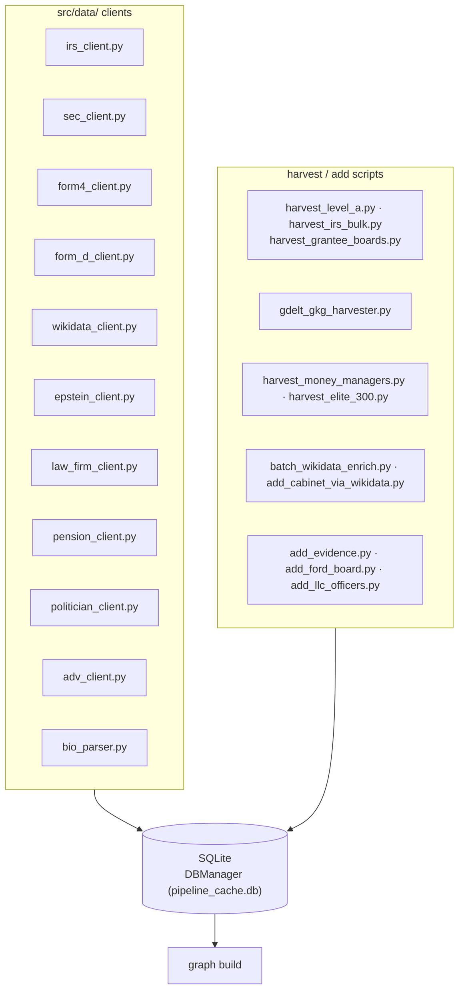

# 1 · Harvesting

> [↑ Hub](README.md) · *Generated from source on 2026-09-04.*

Data acquisition. Each source has a client (in `src/data/`) and, where appropriate, a
top-level `harvest_*.py` / `add_*.py` script that pulls records into the shared SQLite
store (`DBManager`).

## Sources

| Source | Client / script | What it provides |
|---|---|---|
| IRS Form 990 | `irs_client.py`, `harvest_irs_bulk.py`, `harvest_level_a.py`, `harvest_grantee_boards.py` | foundations, grantees, boards |
| SEC | `sec_client.py`, `form4_client.py`, `form_d_client.py` | insider trades (Form 4), fund raises (Form D) |
| GDELT GKG | `gdelt_gkg_harvester.py` | news co-mentions for enrichment |
| Wikidata | `wikidata_client.py`, `batch_wikidata_enrich.py` | entity enrichment, cabinet memberships |
| Epstein documents | `epstein_client.py`, `add_evidence.py` | committee evidence records |
| Other | `law_firm_client.py`, `pension_client.py`, `politician_client.py`, `adv_client.py`, `bio_parser.py` | law-firm links, pensions, politicians, bio parsing |
| Death dates | `fetch_death_dates.py` | deceased records (`deceased.json`) |

## Storage

- **SQLite** via `src/data/db_manager.py` (`DBManager`) is the primary working store.
- Enrichment/identity maps live alongside it: `qid_map.jsonl`, `qid_overlap_edges.jsonl`,
  `enrichment_snapshot.csv`, `lp_sources_registry.csv`.
