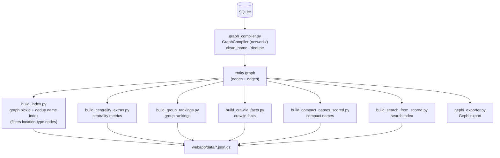

# 2 · Graph building

> [↑ Hub](README.md) · *Generated from source on 2026-09-04.*

Compiles the SQLite records into a deduplicated entity graph and prebuilds the artifacts
the web app serves.

## Key artifacts (`webapp/data/`)

- `graph_edges.json.gz`, `graph_scored.json.gz` — the edge lists (scored in the next
  stage).
- `search_index.json.gz` — search index over deduplicated names.
- `centrality_extras.json.gz`, `group_rankings.json.gz` — precomputed metrics.
- `compact_names.json.gz`, `crawlie_facts.json.gz`, `evidence.json.gz`, `deceased.json`.

## `build_index.py`

The central build script: loads the graph from SQLite via `DBManager`, runs
`GraphCompiler.build_graph()`, and writes the graph pickle + a deduplicated name index,
**filtering out location-type nodes** (houses, addresses, phone numbers) from search.
