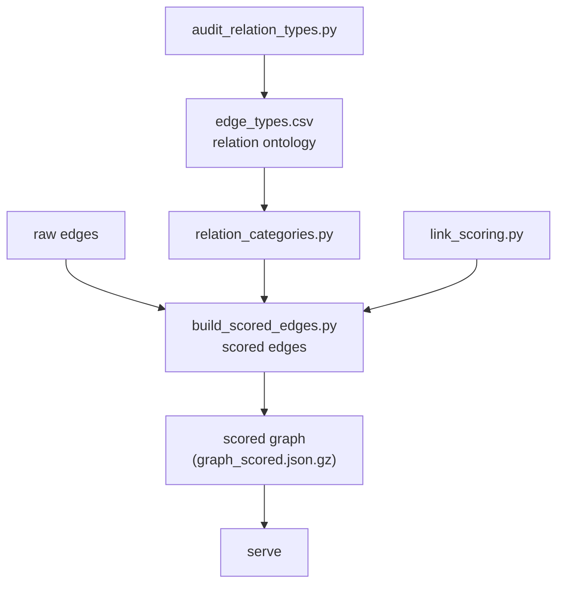

# 3 · Relations & scoring

> [↑ Hub](README.md) · *Generated from source on 2026-09-04.*

Turns raw edges into **scored** relationships. The relation ontology lives in
`edge_types.csv`, and scoring produces the ranked edges the app ranks results by.

## Key pieces

- **`edge_types.csv`** — the vocabulary of relationship types (board membership, family,
  business, etc.).
- **`relation_categories.py`** — maps edge types into categories the app understands.
- **`link_scoring.py`** — scoring rules applied to links.
- **`build_scored_edges.py`** — produces the scored edge set (the recent commit recorded
  ~3.9M edges).
- **`audit_relation_types.py`** — audits the ontology for consistency.

> Note: the serving-side pipeline has been shifted to a faster graph engine ("i-graph")
> for response time — see [04-serving-and-deploy.md](04-serving-and-deploy.md). This
> documentation describes the structure; the pipeline itself is owned by Claude.
