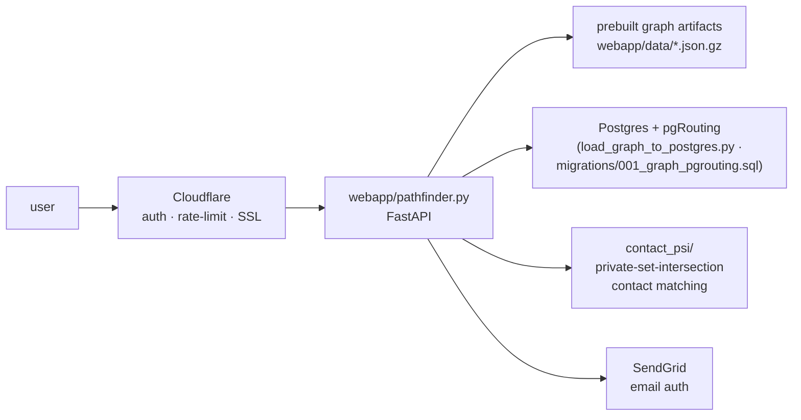

# 4 · Serving & deployment

> [↑ Hub](README.md) · *Generated from source on 2026-09-04.*

A FastAPI app serves the graph to a small, approved set of users behind Cloudflare
access control and SendGrid email auth.

## Serving components

- **`pathfinder.py`** — the FastAPI application.
- **`database.py` / `db.py`** — app-side data access (SQLite and the Postgres path).
- **`load_graph_to_postgres.py` + `migrations/001_graph_pgrouting.sql`** — loads the
  graph into Postgres with **pgRouting** for fast path queries (the response-time
  optimization).
- **`contact_psi/`** — private-set-intersection so contact matching can be done without
  exposing the full contact list.
- **`mentioned_with_fallback.py`** — "mentioned with" lookups with a fallback path.

## Deployment

- **DigitalOcean App Platform** runs the FastAPI app (`Dockerfile`, `app.yaml`).
- **Cloudflare** provides access control (Zero Trust, 10 approved emails), WAF rate
  limiting, and SSL.
- **SendGrid** sends auth emails from the `sixdegrees.net` domain.
- Environment: `APP_ENV=production`, `SECRET_KEY`, `SENDGRID_API_KEY`, `AUTH_DOMAIN`.
