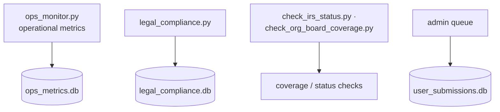

# 5 · Ops & compliance

> [↑ Hub](README.md) · *Generated from source on 2026-09-04.*

Operational monitoring and legal/administrative safeguards for a controlled-access
investigation platform.

## Components

- **`ops_monitor.py`** — operational metrics (`ops_metrics.db`).
- **`legal_compliance.py`** — compliance checks (`legal_compliance.db`).
- **`check_irs_status.py` / `check_org_board_coverage.py`** — coverage and status checks
  over the harvested data.
- **Admin queue** — user submissions with visible success/error feedback
  (`user_submissions.db`).

> Per the project's operating rule, development/admin surfaces are permanently excluded
> from analytics, and the purge tool has been removed. Code and deployment changes to this
> repository are owned by **Claude** — this document set is read-only advisory output.
