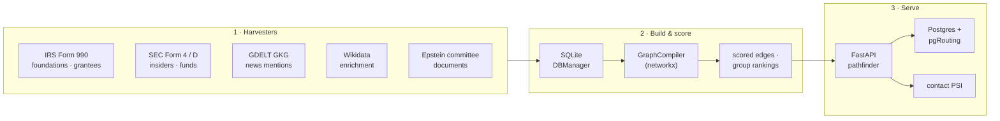

# Social Network Graph Pathfinder (sixdegrees.net) — Architecture

> **Hub.** Click any box (or the links below) to drill into that piece.
>
> *Generated from source on 2026-09-04, read-only. Diagrams are documentation — verify
> against the `build_*.py`, `harvest_*.py`, `src/`, and `webapp/` sources.*

A controlled-access **social-network graph** platform: it harvests public records about
people and organizations, compiles them into a scored graph of relationships, and serves
a search/pathfinder interface to a small, approved set of users.

## Navigate

- [1 · Harvesting](01-harvesting.md)
- [2 · Graph building](02-graph-building.md)
- [3 · Relations & scoring](03-relations-and-scoring.md)
- [4 · Serving & deployment](04-serving-and-deploy.md)
- [5 · Ops & compliance](05-ops-and-compliance.md)

## The one-sentence summary

Public records (IRS, SEC, GDELT, Wikidata, Epstein documents, and more) are harvested into
SQLite, compiled by a `networkx`-based `GraphCompiler` into a deduplicated entity graph,
scored into ranked edges, and served through a FastAPI pathfinder behind Cloudflare
auth — with a Postgres + pgRouting path for fast graph traversal.
